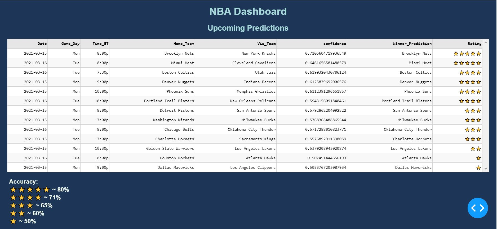

# NBA Predictive Model and Dashboard

This repository provides a comprehensive solution for predicting NBA game outcomes based on historical performance data, along with an interactive dashboard displaying the predictions and relevant betting odds.

## Overview

The application uses historical NBA game data and betting odds to predict the outcomes of upcoming NBA games. It leverages a machine learning model that is trained on the game data and then deployed in a Dash-based web dashboard for visualization.

## Dashboard Examples


## Components

### 1. **NBA Data Scraping & Analysis (`nba_data.py`)**
- Scrapes NBA game data from Basketball Reference and processes it to include team statistics, win-loss records, and other relevant features.
- Generates rolling averages for team performance and includes season averages for both teams and their opponents.
- Prepares the data for predictive modeling by creating unique identifiers for matchups, teams, and games.

### 2. **Betting Odds Scraping (`odds_data.py`)**
- Scrapes real-time betting odds for NBA games from Bovada.
- Extracts team names and odds, cleans the data, and returns a dataframe of the team names and odds for upcoming games.
- Includes a function to calculate implied probabilities from the odds.

### 3. **NBA Predictive Model (`NBA Predictive Model.ipynb`)**
- Analyzes historical NBA data and builds a predictive model for game outcomes using various features like rolling averages, win percentages, and team statistics.
- The model is trained and pickled as `nbaPredict.pickle` for use in real-time predictions.
- The notebook demonstrates the entire analysis process, including data preparation, feature engineering, model training, and evaluation.

### 4. **Main Web Application (`main.py`)**
- A Dash-based web dashboard that displays predictions for NBA games.
- Fetches predictions, odds, and confidence ratings for each game.
- Displays predictions in an interactive table with the following columns:
  - Date, Time, Home Team, Visiting Team, Predicted Winner, Confidence Rating, and Implied Probability.
- The confidence rating is displayed using star ratings (⭐⭐⭐⭐⭐ for highest confidence).
- The dashboard provides a table of upcoming games with predictions, and includes a color-coded table to indicate prediction confidence.

## Tech / Libraries Used
* **Language(s):**
    * Python 3
* **Libraries:**
    * `pandas==version = 1.2.3`
    * `numpy==version = 1.20.1`
    * `re==version = 2021.3.17`
    * `dash==version = 1.19.0`
    * `plotly==version = 4.14.3`
    * `scikit-learn==version = 0.24.1`
    * `lxml`
    * `selenium`
## Installation
To get started with this project, clone the repository and install the necessary dependencies:

```bash
git clone https://github.com/mparasch/nba_dashboard.git
cd nba_dashboard
pip install -r requirements.txt
```

## Usage
### 1. Run the Web Dashboard

To run the interactive dashboard, execute the following in your terminal:
```bash
python main.py
```
This will start a local web server, and you can access the dashboard at http://127.0.0.1:8050/.

### 2. Scraping Data and Making Predictions
   
To run the full predictive model and generate predictions for a given range of NBA seasons, you can use the functions in `nba_data.py` and `odds_data.py`:
* **Scrape NBA data**: `nba_data.scrape_games()`
* **Format by team**: `nba_data.format_by_team()`
* **Feature engineering**: `nba_data.feature_eng()`
* **Generate predictions**: `nba_data.prediction()`

### 3. Training and Using the Model
   
The predictive model is already trained and pickled as `nbaPredict.pickle`. However, if you wish to retrain the model, you can follow the steps outlined in the `NBA Predictive Model.ipynb` notebook.

### 5. Betting Odds
   
Betting odds are scraped and used to generate implied probabilities, which are displayed alongside the predictions in the dashboard. The `odds_data.scrape()` function fetches the odds for the games, and `odds_data.implied_prob()` calculates the implied probabilities.

## Folder Structure
```bash
nba_dashboard/
│
├── nba_data.py              # NBA data scraping and processing
├── odds_data.py             # Betting odds scraping and processing
├── main.py                  # Web dashboard
├── NBA Predictive Model.ipynb # Jupyter notebook for model analysis
├── nbaPredict.pickle        # Pickled predictive model
├── requirements.txt         # List of dependencies
└── README.md                # Project documentation
```

